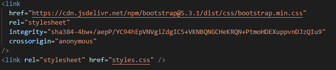

# Introduction
Library application created using HTML, CSS, and JavaScript. The purpose of this 
project was to demonstrate how to organize your code using objects.

## How it works/supposed to work
The user is able to add books to the application and the books will be displayed on the page.
The added books are displayed on their own card on the page. In addition, remove and toggle
buttons enable the user to remove a book from the library and change the read status.

### What I learned 

- How to organize code using objects and object constructors.
- How to override bootstrap by adding a link to your css after 
the cdn link on the html as demonstrated below;

